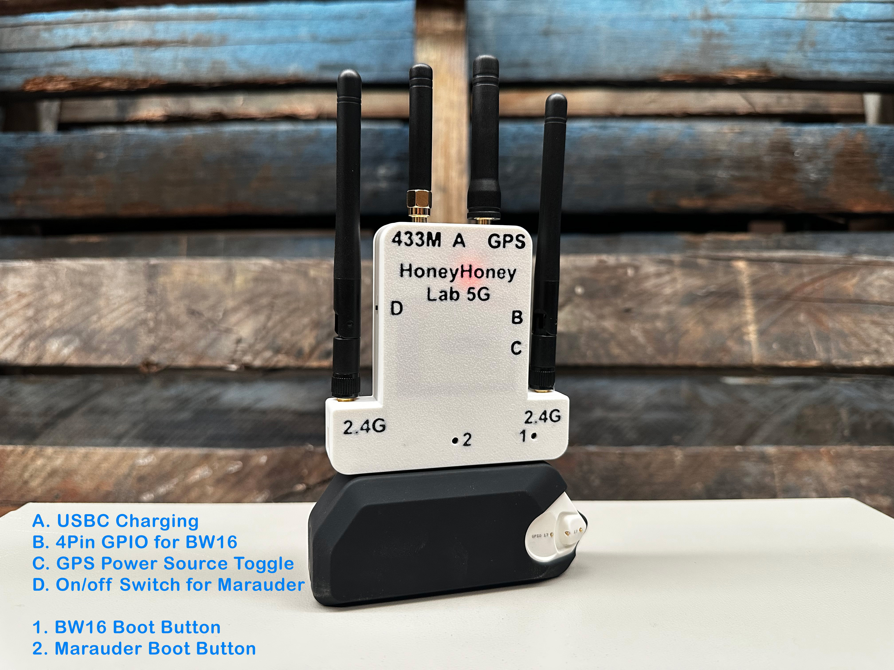
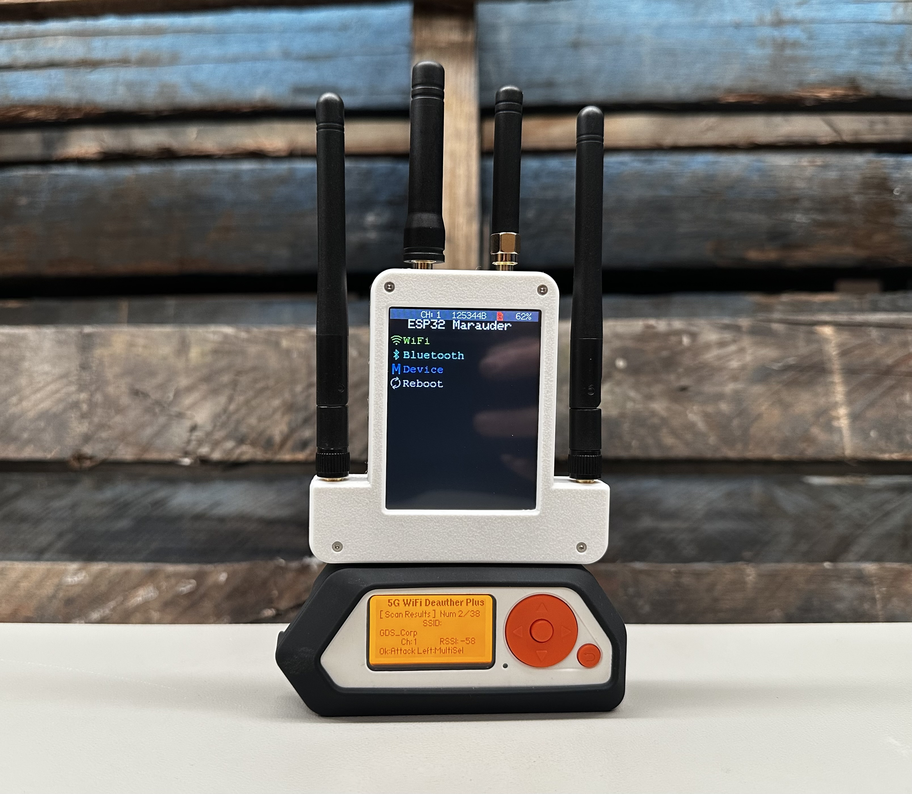
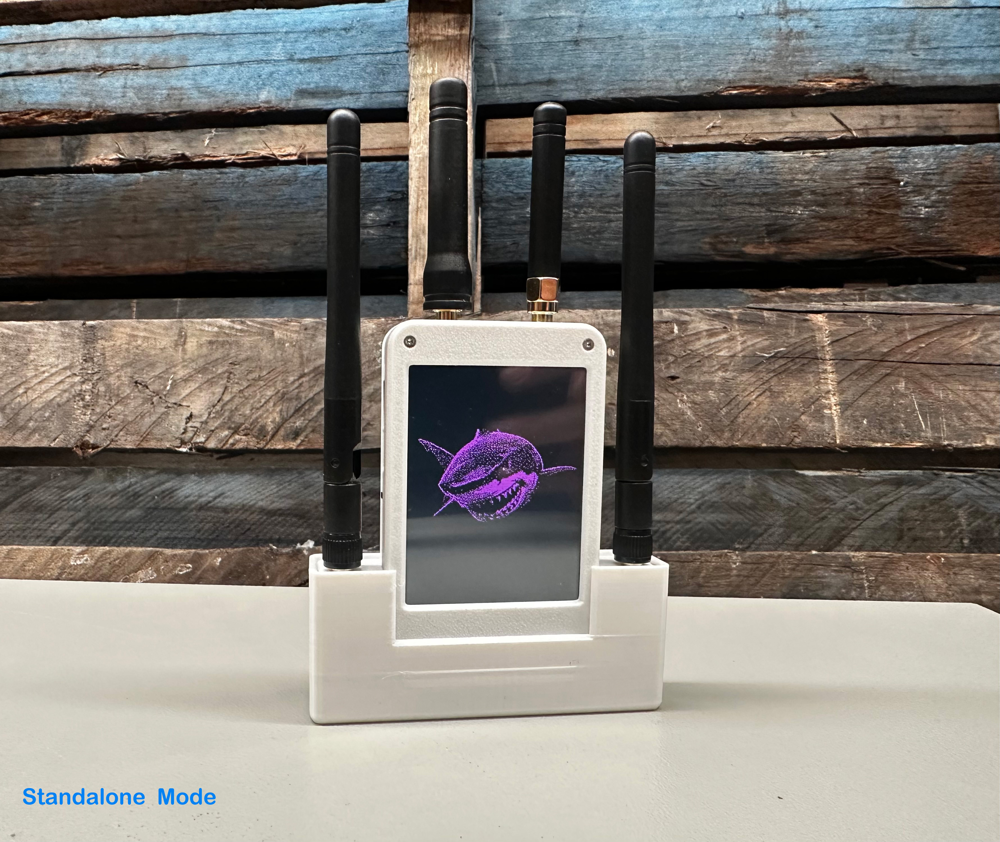
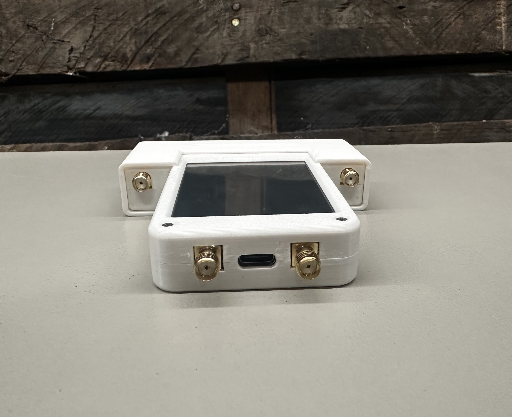
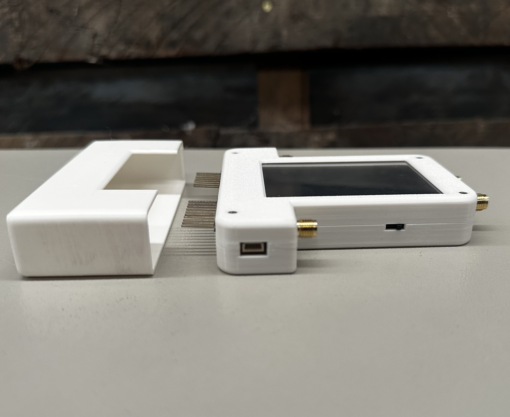
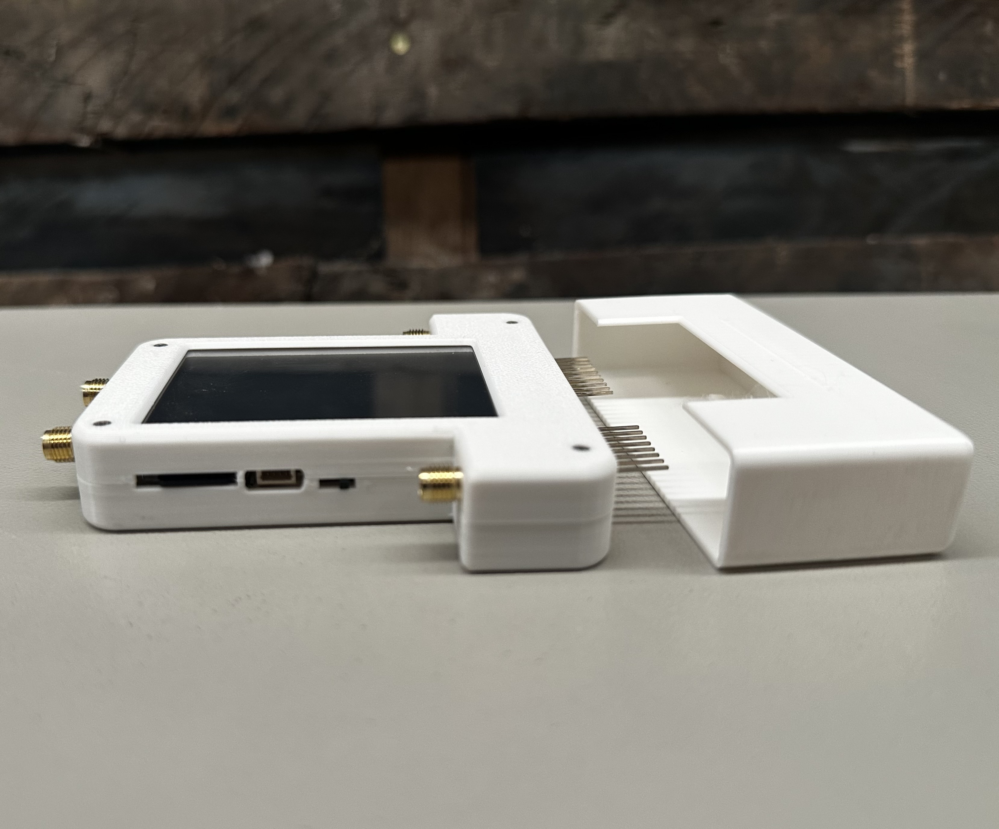

# ESP32 Marauder - Double Barrel 5G User Manual

> [!NOTE]
> - Update: 17 June 2025 by John @ Honey Honey Team
> - All procedures and descriptions related to the Flipper Zero herein were validated using Momentum Firmware, version < MNTM-010 30-04-2025 >.

 

## What is ESP32 Marauder - Double Barrel 5G? 
First of all, what is the ESP32 Marauder Double Barrel? "Double Barrel" refers to the fact that the device runs two standalone Marauders simultaneously. The first Marauder features a 2.8-inch screen, an onboard 800mAh battery, GPS, and a microSD card slot. The second Marauder is connected to and controlled by the Flipper Zero.

Due to the limitations of the ESP32 chipset, the Marauder can currently only handle 2.4 GHz Wi-Fi. However, recent developments with the BW16 chipset have shown promising results for 5G networks. This is exactly what we implemented in the 5G cousin of the Double Barrel.

 

## Specification of the ESP32 Marauder Double Barrel 5G

- **The first Marauder comes with:**
	- ESP32 chipset with an external antenna,
	- A 2.8-inch touch screen,
	- An 800mAh embedded battery, 
	- Onboard GPS access
	- Micro SD card slot, for updating firmware and data storage
	- 4pin GPIO (3.3V/Tx/Rx/Gnd)
  	- This part of the device can funcation as a standalone device (i.e., you can use it without Flipper Zero).
   	- The hardware version of this marauder is V6

- **The BW16 / RTL8720DN chipset is controlled by the Flipper Zero, it comes with**
  	- BW16 / RTL8720DN chipset with an external antenna
  	- Dual-Band 5Ghz + 2.4Ghz scanning, de-authentication
  	- 4pins GPIO 4pin GPIO (3.3V/Tx/Rx/Gnd) for firmware update, or switch different firmware
  	- FAP <Flipper App Package> installation is needed, aka copying the FAP into Flipper SD card

- **Others:**
	- USB-C Ports for onboard battery charging (top).
 	- CC1101 Chipset(433 MHz), supporting up to 10 dB output per antenna.
  	- GPS Chipset. GPS data is accessible to both Marauders.
  	- Four Antennas: 2 x 3 dB for Wi-Fi (Dual Marauder), 1 x 1 dB for GPS, and 1 x 3 dB for SubGhz 433 MHz.
  	- Toggle on the left for switching GPS power supply ( either by Flipper or device battery)
  	- Full 3D-Printed Enclosure/Case is also included.

 

Also, we have aggregated the information between Double Barrel and its 5G counterpart for your reference.

## Pre-flight Check / Settings Before First Use 

> [!NOTE]
> All our products are thoroughly checked and configured prior to shipping. While most of our products are plug-and-play, a few specific settings need to be adjusted on your Flipper Zero to ensure proper communication with the Double Barrel 5G.

 

### SubGhz <433mhz>
- **No initial setup is required for SubGhz chipset detection**. The Flipper Zero automatically recognizes an external SubGhz chipset when it connect to The Double Barrel 5G. 
- To confirm if the Flipper Zero is using the external SubGhz chipset, or to switch to it manually:
	1. On your Flipper Zero, navigate to the main menu.
	2. Go to: **Sub-Ghz** -> **Radio Settings** -> **Module**.
	3. Select **External**."
- The SubGhz part of the Double Barrel is fully functional even the first marauder is in OFF mode

 

### 1st Set Marauder / Standalone section (The one with 2.8inch Touch Screen)

- No initial setup is required
- Turn ON or OFF via the switch located on the right side of the Double Barrel / (labeled <**D**>)
- If you would like to update the firmware, please remeber to download **V6 version** of the firmware BIN file

 

### The BW16 part

A. The BW16 part use UART 15 and 16 for communicating with Flipper, hence it is necessary to switch from the default 13 & 14 GPIO to 15 & 16
	1. On your Flipper Zero, navigate to the main menu.
	2. Go to: **Momentum** -> **Protocols** -> **GPIO Pins** -> **ESP32/8266 UART**.
	3. Select **Extra 15, 16**."
B. Then, The FAP file need to copy into Flipper SD card, as showed in the following. 
	1. Download the FAP file from [here]()
 	2. Copy the file into <you SD card/Apps/GPIO> directory. You could use Micro SD card reader or qFlipper App for the job. 
  	3. Put the SD card back into Flipper, and you should be able to find an APP call xxx in through Flipper manual **APPS** -> **GPIO** 
 

### GPS
- To use the GPS function on the Flipper Zero, please see the steps below.
  	1. Set the **bottom switch** on the left side of the Double Barrel (labeled <**C**>) to the **DOWN** position.
		- UP position: GPS is powered by the Double Barrel's onboard 800mAh battery.
  		- DOWN position: GPS is powered by the Flipper Zero's battery.
  	2. On your Flipper Zero, navigate to the main menu.
	3. Go to: **Momentum** -> **Protocols** -> **GPIO Pins** -> **NWEA GPS UART**.
	4. Select **Default 13, 14**."
	5. For testing purpose, Go to **Apps** -> **GPIO** -> **[NMEA]GPS**.
	6. Acquiring a GPS signal might take up to a minute. The exact time depends on your location and how open or obstructed the sky is.

 

## How to upgrade Marauder firmware

 Click the Triangle for more details   

### 1st Set Marauder (The one with 2.8inch Touch Screen)

1. Take the Micro SD card from the Double Barrel and connect to an PC / Laptop / Mac / whatever

2. Download the **V6** firmware file, which is usual inclued < **_new_hardware.bin/_v6.bin** > in the name, from [Marauder website](https://github.com/justcallmekoko/ESP32Marauder/releases).
   
3. Copy the file to the Micro SD card and rename it as< **update.bin** >. Then, insert the Micro SD card back into the Marauder Unit.

4. Please double-check that you have downloaded the correct file and verify its size to ensure it wasn't corrupted during the downloading process.
   
5. Turn on the Marauder Unit Navigating menu as following: < **Device** > => < **Update firmware** > => < **SD Update** > => < **Yes** >. 
   
6. In a minute, The unit should restart itself and you are golden.

 

## How to upgrade BW16 firmware

Due to the ongoing development of BW16 firmware, an [ESP32 programmer](https://www.tindie.com/products/39033/) is included in Double Barrel 5G package, which we are going to utilise in the following proceduce. 

>	- **Side/Outer Button**: This button, located closer to the edge/side of the device, is the boot button for the 2nd Marauder with ESP32-S2.

1. Open the Web Flasher called < ESPWebTool > [https://esp.huhn.me/](https://esp.huhn.me).
   
2. To start the 2nd Marauder in Bootloader mode:

	- Use the metal stylus to **press and hold the boot button** for the 2nd Marauder (this is the button closer to the side/edge of the Double Barrel).
	- While still **holding the boot button, connect the USB-C cable** to the Double Barrel.
	- The board will then launch into Bootloader mode instead of starting up normally. You can now release the boot button.

3. Then, navigate to https://esp.huhn.me/,
	- On the webpage, click the [ **Connect** ] button.
 	- A pop-up window will appear, select the option similar to [ **USB Serial (ComXxX) - Paired** ]
  	- Then, click [ **Connect** ] button within the pop-up window.
   
4. Navigate to the Firmware Page:
	- Go to the [ESP32 Marauder firmware update guide:](https://github.com/justcallmekoko/ESP32Marauder/wiki/update-firmware#using-spacehuhn-web-update). 
	- On this page, find / search the section specifically for the "Flipper Zero Wifi Dev Board", like the following picture. This is crucial for getting the correct files.
	- From the "Flipper Zero Wifi Dev Board" section, download the following four (4) files:
	- Bootloader, Partitions, Boot App, Firmware(Look for a .bin file that specifically includes _rev_feather.bin in its name for the firmware)

5. Return to the [HESP.huhn.me](https://esp.huhn.me/). You will now select the files you downloaded in the previous steps. Carefully match each downloaded file (Bootloader, Partitions, Boot App, and Firmware) to its correct field on the webpage, as shown in the picture below/adjacent.

6. Please double check everything before clicking [ **PROGRAM** ] bottom.
    
7. In a minute then you are golden. 

 

## Our official shop if you would like to support us.  
1. [Our official site](https://honeyhoneylab.com/)
2. [Tindie](https://www.tindie.com/stores/honeyhoneytrading/)
3. ~~[ETSY Shop](https://www.etsy.com/au/shop/HoneyHoneyTrading)~~

 

## Warrenty and Tech Support

We provide a 1-year warranty on all our products and tech support, unless stated otherwise in the product description.

FYI, our [Etsy](https://www.etsy.com/au/shop/HoneyHoneyTrading) shop is no longer in operation. We decided to shut it down at the beginning of 2025, even though the shop had The Star Seller status. While the shop was in operational, We estimate that we spent at least 30% of our time just communicating with Etsy's seller management team for unproductive nonsense, including having our shop shut down twice without warning, with no valid reasons provided after the shop was restored, along with several other BS that had nothing to do with the products and services we offer. 

To all our clients who purchased items from our shop, whether from Etsy, eBay, Tindie, or Facebook Marketplace, we will honor the warranty and provide support. Please feel free to email us at Support@honeyhoneylab.com. or [Whatsapp](https://wa.me/61452559581) 

 

## FAQ 

## Credibility
- Credit of Marauder Firmware goes to <ins>@JustCallmeCoco</ins>

 

## Metadata / keywords / about for bots ##
flipper zero, flipper, wifi board, marauder, network security, esp32, cc1101, nrf24, subghz, 2.4ghz, wifi, GPS
